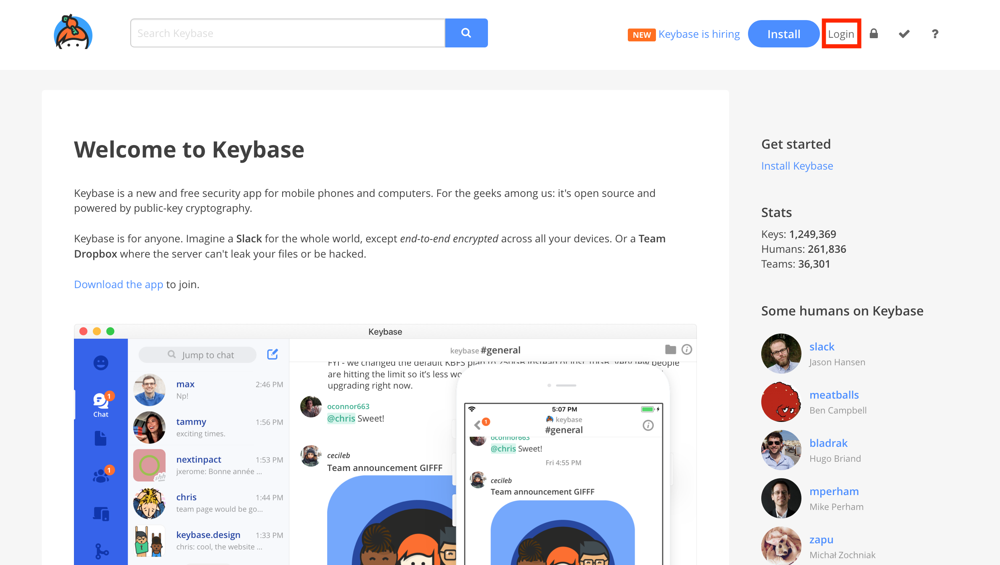
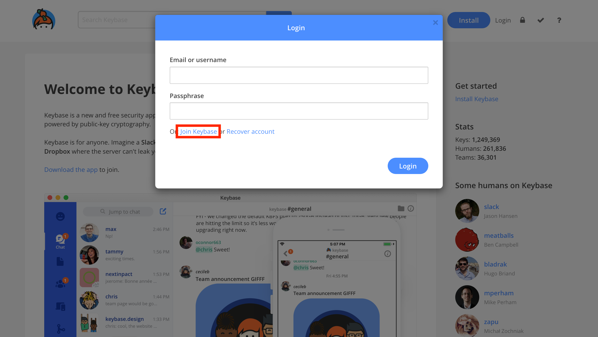
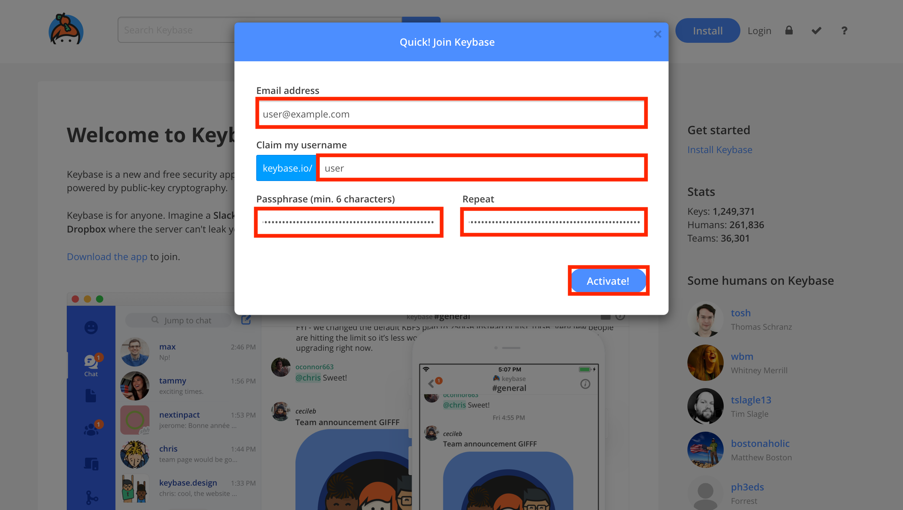
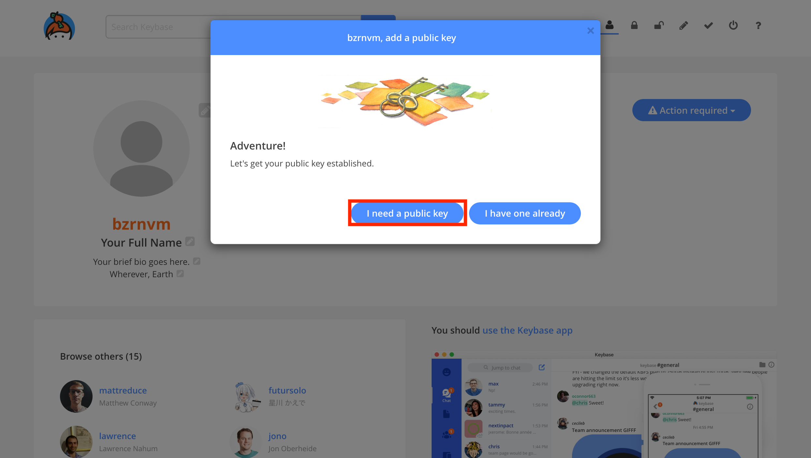
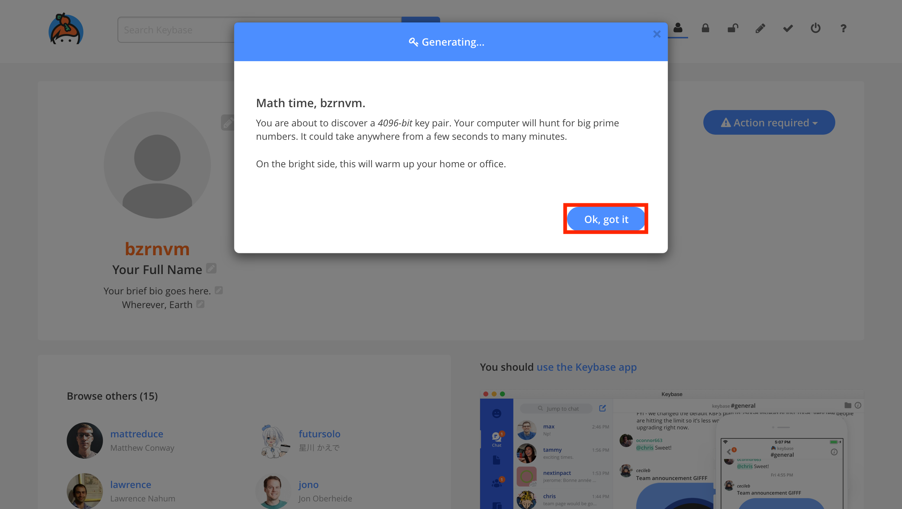
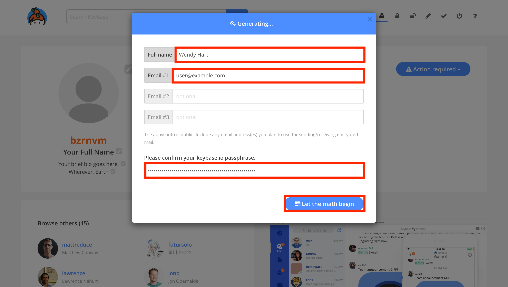
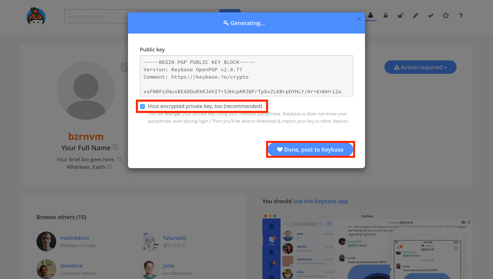

# GPGit

---

# GPG

## GNU GPLv3

---

# PGP

## Commercial proprietary software

---

# INSTALL GPG

```sh
$ brew install gnupg
Updating Homebrew...
......
$ cat .bashrc
GPG_TTY=$(tty)
export GPG_TTY
```

---

# GENERATE KEY

```sh
$ gpg --generate-key
gpg (GnuPG) 2.2.4; Copyright (C) 2017 Free Software Foundation, Inc.
This is free software: you are free to change and redistribute it.
There is NO WARRANTY, to the extent permitted by law.

Note : Use "gpg --full-generate-key" for a full featured key generation dialog.

GnuPG needs to construct a user ID to identify your key.

Real name: Alice
Email address: alice@example.com
You selected this USER-ID:
    "Alice <alice@example.com>"

Change (N)ame, (E)mail, or (O)kay/(Q)uit? o
```

----

# GENERATE KEY

```sh
   ┌──────────────────────────────────────────────────────┐
   │ Please enter the passphrase to                       │
   │ protect your new key                                 │
   │                                                      │
   │ Passphrase: ________________________________________ │
   │                                                      │
   │       <OK>                              <Cancel>     │
   └──────────────────────────────────────────────────────┘
```


----

# GENERATE KEY

```sh
We need to generate a lot of random bytes. It is a good idea to perform
some other action (type on the keyboard, move the mouse, utilize the
disks) during the prime generation; this gives the random number
generator a better chance to gain enough entropy.
We need to generate a lot of random bytes. It is a good idea to perform
some other action (type on the keyboard, move the mouse, utilize the
disks) during the prime generation; this gives the random number
generator a better chance to gain enough entropy.
gpg: key 95601890AFD80709 marked as ultimately trusted
gpg: revocation certificate stored as '/Users/alice/.gnupg/openpgp-revocs.d/DA39A3EE5E6B4B0D3255BFEF95601890AFD80709.rev'
public and secret key created and signed.

pub   rsa2048 2018-01-10 [SC] [expires: 2020-01-03]
      DA39A3EE5E6B4B0D3255BFEF95601890AFD80709
uid                      Alice <alice@example.com>
sub   rsa2048 2018-01-10 [E] [expires: 2020-01-03]
```

---

# GET KEY ID

```sh
$ gpg --list-keys
/Users/alice/.gnupg/pubring.kbx
--------------------------------------
pub   rsa2048 2018-01-03 [SC] [expires: 2020-01-03]
      DA39A3EE5E6B4B0D3255BFEF95601890AFD80709
uid           [ultimate] Alice <alice@example.com>
sub   rsa2048 2018-01-03 [E] [expires: 2020-01-03]
```

---

# DISTRIBUTE KEY

```sh
$ gpg --keyserver keyserver.ubuntu.com --send-keys DA39A3EE5E6B4B0D3255BFEF95601890AFD80709
gpg: sending key 95601890AFD80709 to hkp://keyserver.ubuntu.com
```

Note that you can compute the short key id by yourself e.g.

```sh
tail -c 17 <<< DA39A3EE5E6B4B0D3255BFEF95601890AFD80709
```

---

# VERIFY KEY DISTRIBUTION

```sh
$ gpg --keyserver keyserver.ubuntu.com --recv-keys DA39A3EE5E6B4B0D3255BFEF95601890AFD80709
gpg: key 95601890AFD80709: "Alice <alice@example.com>" not changed
gpg: Total number processed: 1
gpg:              unchanged: 1
```

---

# SIGN ON GIT COMMIT

```sh
$ git config --global commit.gpgsign true
$ git config --global user.signingkey DA39A3EE5E6B4B0D3255BFEF95601890AFD80709
```

---

# ADD TO GITHUB

```sh
$ gpg --export --armor
-----BEGIN PGP PUBLIC KEY BLOCK-----

mQENBFpM0uoBCAC1oDd/QgEtBnOZXPEPQd+ZSY9T8vIgFW7rdDIipMCIVCsDNPH3
s78wiJS43mf93nHhWc8iXezF4M6ibzLGhb3/iFp6Db4oIJfuVsIhLpMc+znRnPJo
SjFwTJ8tNGdYh7Dtbq1W17HeHRIo/am1TG5hjrW90ISZYNqJEKPwKBrczzyr7UAI
oLk3hMDDLCHqVecZAuF+Lp/F61gPNhPUASfLrlUrGzvOn6VAXTRGscsS8287wkQz
rhsncmn5e4Nrx/elsAe16GytOwhRh2BPrcIa5QpwYRpcnyqDw2EVXfa2qRMZR+Je
......
b/E=
=nv7I
-----END PGP PUBLIC KEY BLOCK-----
$ open https://github.com/settings/gpg/new
```

---

# VERIFY SIGNATURE

```sh
$ mkdir -p /tmp/gpgit && cd /tmp/gpgit && git init
Initialized empty Git repository in /private/tmp/gpgit/.git/
$ touch hello && git add hello && git commit -m 'Verify git show --show-signature'
[master (root-commit) d78ff13] Verify git show --show-signature
 1 file changed, 0 insertions(+), 0 deletions(-)
 create mode 100644 hello
```

----

# VERIFY SIGNATURE

```sh
$ git show --show-signature
commit 7324d0475f22d42c180ac0eab2ded0bd6e86c830 (HEAD -> master)
gpg: Signature made Thu Jan 11 23:42:19 2018 CST
gpg:                using RSA key DA39A3EE5E6B4B0D3255BFEF95601890AFD80709
gpg: checking the trustdb
gpg: marginals needed: 3  completes needed: 1  trust model: pgp
gpg: depth: 0  valid:   1  signed:   0  trust: 0-, 0q, 0n, 0m, 0f, 1u
gpg: next trustdb check due at 2020-01-03
gpg: Good signature from "Alice <alice@example.com>" [ultimate]
Author: Alice <alice@example.com>
Date:   Thu Jan 11 23:42:19 2018 +0800

    Add verify key

diff --git a/hello-gpg b/hello-gpg
new file mode 100644
index 0000000..e69de29
```

---

# SIGN ON TAG

```sh
$ git tag -s 1.0.0 -m 'GPGit 1.0.0' && git show --show-signature 1.0.0 | cat
tag 1.0.0
Tagger: sharils <sharils@users.noreply.github.com>
Date:   Sat Jan 13 09:28:48 2018 +0800

GPGit 1.0.0
-----BEGIN PGP SIGNATURE-----

iQEzBAABCAAdFiEEJqlGM5RksVxB3xOUOE3cuaxtebUFAlpZYNAACgkQOE3cuaxt
ebVRwgf/Y7UWSuSHUaFjDUvI2iMb9d1A4vmyIaj0+v+EwIx5DyZ3x4UED+ZJdNnF
......
-----END PGP SIGNATURE-----

commit d75aa910811ba18c524e30d1a4e3d6c40b54ee36
gpg: Signature made Fri Jan 12 00:00:35 2018 CST
gpg:                using RSA key 26A946339464B15C41DF1394384DDCB9AC6D79B5
gpg: Good signature from "sharils <sharils@users.noreply.github.com>" [ultimate]
Author: sharils <sharils@users.noreply.github.com>
Date:   Fri Jan 12 00:00:35 2018 +0800
......
```

---

# SIGNATURE ON GITHUB

## [COMMITS][1]

[1]: https://github.com/nodejs/node/commits/master

---

# SIGNATURE ON GITHUB

## [TAG][1]

[1]: https://github.com/nodejs/node/tags

---

# GIT-CRYPT

## Transparent file encryption in git

---

# INSTALL GIT-CRYPT

```sh
$ brew install git-crypt
Updating Homebrew...
==> Auto-updated Homebrew!
Updated 1 tap (homebrew/core).
==> Updated Formulae
digdag

==> Downloading https://homebrew.bintray.com/bottles/git-crypt-0.6.0.high_sierra.bottle.tar.gz
######################################################################## 100.0%
==> Pouring git-crypt-0.6.0.high_sierra.bottle.tar.gz
🍺  /usr/local/Cellar/git-crypt/0.6.0: 9 files, 294.4KB
```

---

# INIT GIT-CRYPT

```sh
$ git-crypt init
Generating key...
$ echo 'secretfile filter=git-crypt diff=git-crypt' >> .gitattributes && git add .gitattributes && git commit -m 'Add .gitattributes'
[master 28e8099] Add .gitattributes
 1 file changed, 2 insertions(+)
 create mode 100644 .gitattributes
$ echo 'top secret' >> secretfile && git add secretfile && git commit -m 'Add secretfile'
[master 16e0911] Add secretfile
 1 file changed, 0 insertions(+), 0 deletions(-)
 create mode 100644 secretfile
```

---

# GRANT PERMISSION

```sh
$ git-crypt add-gpg-user DA39A3EE5E6B4B0D3255BFEF95601890AFD80709
[master d75aa91] Add 1 git-crypt collaborator
 2 files changed, 4 insertions(+)
 create mode 100644 .git-crypt/.gitattributes
 create mode 100644 .git-crypt/keys/default/0/DA39A3EE5E6B4B0D3255BFEF95601890AFD80709.gpg
 ```

---

# VERIFY LOCKED

```sh
$ git clone . /tmp/crypt && cd /tmp/crypt
Cloning into '/tmp/crypt'...
done.
$ cat secretfile
GITCRYPT?jD?I!?????$&b?8D?m?
```

Note: You can also use git status to verify encryption status right after commit

---

# UNLOCK SECRETFILE

```sh
$ git-crypt unlock && cat secretfile
top secret
```

---

# UPDATE SECRETFILE

```sh
$ echo 'update secret' >> secretfile && git commit -m 'Update secretfile' secretfile
[master 54e2e75] Update secretfile
 1 file changed, 0 insertions(+), 0 deletions(-)
```

---

# REVOKE PERMISSIONS

```sh
$ git revert d75aa91
[master 6ba2787] Revert "Add 1 git-crypt collaborator"
 2 files changed, 4 deletions(-)
 delete mode 100644 .git-crypt/.gitattributes
 delete mode 100644 .git-crypt/keys/default/0/26A946339464B15C41DF1394384DDCB9AC6D79B5.gpg
$ git-crypt unlock
Error: no GPG secret key available to unlock this repository.
To unlock with a shared symmetric key instead, specify the path to the symmetric key as an argument to 'git-crypt unlock'.
```

---

# [KEYBASE](https://keybase.io/)

## ENCRYPTED PERSONAL OR TEAM REPOSITORY AND OTHERS

---

# CAUTION

## KEYBASE CLIENT SHOULD BE INSTALLED IN AT LEAST TWO MACHINES

---

# SIGN UP



----

# SIGN UP



----

# SIGN UP



---

# ADD A GPG KEY


----

# ADD A GPG KEY



----

# ADD A GPG KEY



----

# ADD A GPG KEY



----

# ADD A GPG KEY



---

# KEYBASE GIT COMMANDS

```sh
$ keybase git
NAME:
   keybase git - Manage git repos

USAGE:
   keybase git <command> [arguments...]

COMMANDS:
   create	Create a personal or team git repository.
   delete	Delete a personal or team git repository.
   list		List the personal and team git repositories you have access to.
   gc		Run garbage collection on a personal or team git repository.
   settings	View and change team repo settings
   help, h	Shows a list of commands or help for one command
```

---

# CREATE KEYBASE GIT REPOSITORY

```sh
$ keybase git create reponame
Repo created! You can clone it with:
  git clone keybase://private/alice/reponame
```

---

# CLONE A KEYBASE REPO

```sh
$ git clone keybase://private/alice/reponame /tmp/reponame
Cloning into '/tmp/reponame'...
Initializing Keybase... done.
Syncing with Keybase... done.
Syncing encrypted data to Keybase: (100.00%) 2.22/2.22 KB... done.
warning: You appear to have cloned an empty repository.
```

---

# Q&A

---

# Thank

---

# Reference

- [Introduction to GPG Encryption and git-crypt - Samsung Open Source Group Blog][1]
- [Git - Signing Your Work][2]
- [bash - keyserver timed out when trying to add a GPG public key - Unix & Linux Stack Exchange][3]
- [git-crypt - transparent file encryption in git][4]

[1]: https://web.archive.org/web/20180113005646/https://blogs.s-osg.org/introduction-gpg-encryption-git-crypt/
[2]: https://web.archive.org/web/20171222033413/https://git-scm.com/book/en/v2/Git-Tools-Signing-Your-Work
[3]: https://web.archive.org/web/20161120004044/http://unix.stackexchange.com:80/questions/75892/keyserver-timed-out-when-trying-to-add-a-gpg-public-key
[4]: https://www.agwa.name/projects/git-crypt/
